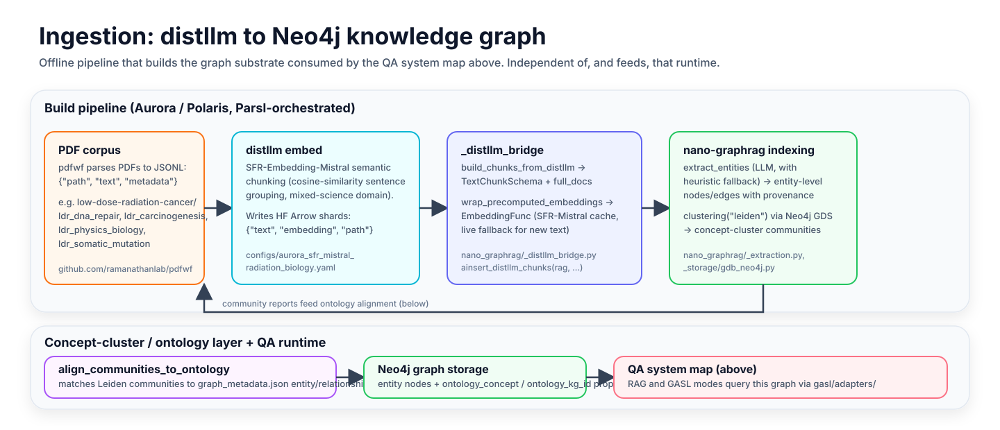

# nano-graphrag

<p align="center">
  
</p>

`nano-graphrag` is a graph-native QA workbench with a browser UI, a
deterministic/LLM hybrid answer path, and a live execution surface for
graph-aware reasoning.

The product surface is the visualization and question-answering system:

- load a GraphML graph
- inspect nodes, neighborhoods, and salience
- run fast RAG answers over a retrieved subgraph
- run GASL plans over the live graph with step-by-step telemetry
- review traces, prompts, and answer-view selection decisions

The graph-building pipeline still exists, but it is no longer the center
of the main README. If you need ingestion and graph construction, start
with [Graph Building](docs/GRAPH_BUILDING.md).

## Product surface


### Two query modes

- **RAG mode**  
  Fast subgraph retrieval followed by answer synthesis. Good for quick
  lookups and broad orientation.

- **GASL mode**  
  The Graph Action Specification Language. An LLM emits a bounded graph
  plan, the executor runs it step by step against graph adapters, and
  the browser streams the traversal, intermediate state, and final
  answer.

### What the UI exposes

- graph search, entity-type filters, salience filtering
- node details and neighborhood focusing
- BYOK model selection in the browser
- prompt observations and GASL replay surfaces
- side-by-side demo scenarios for RAG vs GASL behavior

## System map


## Ingestion pipeline



The QA system map above is the runtime; this is the offline pipeline that
builds the graph it queries. PDFs are parsed by
[pdfwf](https://github.com/ramanathanlab/pdfwf) into JSONL, semantically
chunked and embedded by [distllm](https://github.com/ramanathanlab/distllm)
(SFR-Embedding-Mistral), and converted by
[`nano_graphrag/_distllm_bridge.py`](nano_graphrag/_distllm_bridge.py) into
nano-graphrag's `TextChunkSchema` plus precomputed embeddings — skipping
nano-graphrag's own chunker. From there, normal entity/relationship
extraction and Leiden clustering produce entity-level nodes and
concept-cluster communities; `align_communities_to_ontology` then matches
those communities against domain ontology schemas (e.g.
`low-dose-radiation-cancer/*/graph_metadata.json`), giving the graph both
entity-level and concept/ontology-level granularity.

- Aurora distllm config: [configs/aurora_sfr_mistral_radiation_biology.yaml](configs/aurora_sfr_mistral_radiation_biology.yaml)
- End-to-end example: [examples/radiation_biology_neo4j_pipeline.py](examples/radiation_biology_neo4j_pipeline.py)

## Encoders and storage integrations

### Embedding encoders (`embedding_func`)

| Encoder | Source | Notes |
| --- | --- | --- |
| OpenAI / Azure OpenAI `text-embedding-3-small` | [`nano_graphrag/_llm.py`](nano_graphrag/_llm.py) | default |
| Amazon Bedrock Titan embeddings | [`nano_graphrag/_llm.py`](nano_graphrag/_llm.py) | via `using_amazon_bedrock=True` |
| Local sentence-transformers / Ollama | [examples/using_local_embedding_model.py](examples/using_local_embedding_model.py), [examples/using_ollama_as_llm_and_embedding.py](examples/using_ollama_as_llm_and_embedding.py) | runs fully offline |
| SFR-Embedding-Mistral via distllm | [`nano_graphrag/_distllm_bridge.py`](nano_graphrag/_distllm_bridge.py) | precomputed semantic-chunk embeddings from distllm, with live SFR-Mistral fallback for text distllm never saw (queries, LLM-written summaries) |

### Storage backends (`graph_storage_cls`, `vector_db_storage_cls`)

| Backend | Module | Notes |
| --- | --- | --- |
| NetworkX (default graph store) | [`nano_graphrag/_storage/gdb_networkx.py`](nano_graphrag/_storage/gdb_networkx.py) | local GraphML file, no external services |
| Neo4j + GDS (Leiden clustering) | [`nano_graphrag/_storage/gdb_neo4j.py`](nano_graphrag/_storage/gdb_neo4j.py) | required for the distllm ingestion pipeline above; see [docs/use_neo4j_for_graphrag.md](docs/use_neo4j_for_graphrag.md) |
| NanoVectorDB / HNSWLib (vector stores) | [`nano_graphrag/_storage/vdb_nanovectordb.py`](nano_graphrag/_storage/vdb_nanovectordb.py), [`nano_graphrag/_storage/vdb_hnswlib.py`](nano_graphrag/_storage/vdb_hnswlib.py) | entity/chunk vector indexes |
| JSON KV store | [`nano_graphrag/_storage/kv_json.py`](nano_graphrag/_storage/kv_json.py) | docs, chunks, community reports, LLM cache |

## Runtime architecture

### Main components

- **Browser UI**  
  [visualization/templates/viewer.html](visualization/templates/viewer.html)

- **HTTP + Socket.IO surface**  
  [visualization/server.py](visualization/server.py)

- **Query orchestration**  
  [visualization/query_engine.py](visualization/query_engine.py)

- **GASL planner / executor**  
  [gasl/executor.py](gasl/executor.py)

- **Answer-view compiler**  
  [gasl/answer_layer/compiler.py](gasl/answer_layer/compiler.py),
  [gasl/answer_layer/selector.py](gasl/answer_layer/selector.py),
  [gasl/answer_layer/adjudicator.py](gasl/answer_layer/adjudicator.py)

- **Graph adapters**  
  [gasl/adapters/](gasl/adapters/)

- **Prompt and trace sidecars**  
  `gasl_artifacts/prompt_observations.jsonl`,
  `gasl_artifacts/traces/*.jsonl`

### How answering works

1. The browser sends a question to the query server.
2. The query engine routes to either RAG or GASL.
3. GASL planning and execution mutate state through graph-native
   commands such as `FIND`, `GRAPHWALK`, `PROCESS`, `AGGREGATE`, and
   `RANK`.
4. The answer layer compiles candidate views from current state:
   `evidence_table`, `grouped_summary`, `distribution`, `comparison`,
   `frontier`, `ranking`, `provenance`.
5. Deterministic selection runs first; an LLM adjudicator only breaks
   ties when multiple structurally valid views remain.
6. The final answer is synthesized from the chosen view rather than from
   a raw state dump.

## Quick start

### Run the UI

```bash
git clone https://github.com/chian/nano-graphrag.git
cd nano-graphrag
python3 -m venv .venv
. .venv/bin/activate
pip install -r requirements.txt

# launch against a sample graph
./launch_viz.sh tests/nano_graphrag_cache_TEST/graph_chunk_entity_relation.graphml
```

Open `http://127.0.0.1:5050`, paste an API key in the browser, select a
model, and ask a question.

### Serve over Tailscale

```bash
HOST=0.0.0.0 ./launch_viz.sh path/to/your.graphml
tailscale serve --bg --https=443 http://localhost:5050
```

## Documentation

- [Graph Building](docs/GRAPH_BUILDING.md)
- [GASL Guide](docs/GASL_GUIDE.md)
- [GASL Behavior Eval](docs/GASL_BEHAVIOR_EVAL.md)
- [Runtime Invariants](docs/RUNTIME_INVARIANTS.md)
- [Architecture Notes](docs/ARCHITECTURE.md)

## Repository guide

```text
gasl/                    planner, executor, commands, answer-layer logic
visualization/           Flask UI, query engine, browser surface
nano_graphrag/           graph substrate helpers and storage integration
graph_enrichment/        merge and enrichment passes for graph construction
iterative_search/        search-driven graph growth pipeline
tools/prompt_lab/        offline prompt-mining, verification, and GEPA flows
docs/                    operator notes, guides, and diagrams
```

## Design stance

This repo treats the graph as the substrate, not the product. The
product is the question-answering loop built on top of the graph:

- deterministic graph actions where truth should stay deterministic
- bounded LLM use where ambiguity actually requires semantics
- explicit sidecars for traces, prompts, and answer-view decisions
- an operator-friendly UI instead of hidden backend-only orchestration
